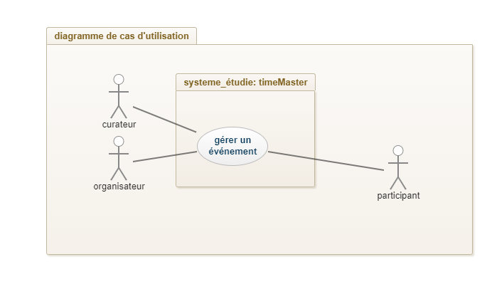

# I	Fondements du projet
## 1. But du projet
### a. Problème de l’utilisateur ou contexte du projet 
####   Les utilisateurs ont besoin d'une app mobile complète et facile à utiliser pour gérer les évènements, ce qui n'existe pas dans la marché actuelle.
### b. Objectifs du projet
####   Ce produit a pour but de répondre la demande des utilisateurs, de augementer la célébrité de l'entreprise et de faire du profit. 
## 2. Personnes et organismes impliqués dans les enjeux du projet 
### a. Maître d’ouvrage
#### L'acteur à l'origine du projet est l'entreprise TimeMaster. C'est le maitre d'ouvrage qui formule sa demande en fonction de son besoin.
### b. Acheteur
#### Les acheteurs du produit sont les organisateurs d'évènements. Ils achètent un compte professionnel qui leur permet de proposer des évènements sur l'application.
### c. Autre parties prenantes
#### Des curateurs proposent des conseils quant à la conception et l'utilisation de l'application.
## 3. Utilisateurs du produit
### a. Utilisateurs directs du produit
### b. ~~Priorité assignée aux utilisateurs~~ 
### c. ~~Implication nécessaire de la part des utilisateurs dans le projet~~
### d. Utilisateurs concernés par les opérations de maintenance du produit
# II	Contraintes sur le projet 
## 4. Contraintes non négociables
### a. Contraintes sur la conception de la solution
####   L'application doit pouvoir gérer les évènements. 
### b. Environnement de fonctionnement du système actuel
####   L'application sera installé sur les téléphones mobiles, il peut intéragir avec les organisateurs d'évènements, les participants d'évènement et les curateurs d'évènements.
### c. Applications « partenaires » (avec lesquelles le produit doit collaborer)
####   L'application peut être installé sur Android et IOS et peut être accessible par les navigateurs.
### d. « COTS » : Progiciels ou composants commerciaux
####   L'application doit connecter aux APIs de Google Map pour l'exigence de citer les lieux et pour le système de trajectoire.
### e. Lieux de fonctionnement prévus
####   Les lieux de foctionnement seront divers. Les utilisateurs peut utiliser le produit où ils veulent.
### f. ~~De combien de temps les développeurs disposent-ils pour le projet ?~~
### g. ~~Quel est le budget affecté au projet ?~~
## 5. Glossaire et conventions de dénomination
## 6. Faits et hypothèses utiles
### a. Facteurs influençant le produit, mais qui ne sont pas des contraintes imposées sur les exigences
### b. Hypothèses que l’équipe fait sur le projet 
# III	Exigences fonctionnelles
## 7. Portée du travail
### a. La situation actuelle
####   Nous possèdons le grille de Levesque, la liste d'exigences qualifiées et la cahier des charges. Nous avons besoin de mettre l'app en oeuvre.
### b. ~~Contexte du travail~~
### c. ~~Division du travail en événements métier~~
## 8. Portée du produit (cas d’utilisations)
### a. Limites du produit : diagramme de cas d’utilisation
#### 
### b. Description sommaire des cas d’utilisation
#### Voir annexe 1
## 9. Exigences fonctionnelles et exigences sur les données
### a. Exigences fonctionnelles
####   Voir la liste d'exigences qualifiée
# IV	Exigences non fonctionnelles
## 10. Ergonomie et convivialité du produit
### a. L’interface
### b. Le style du produit (packaging inclus)
## 11. Facilité d’utilisation et facteurs humains 
### a. Facilité d’utilisation
#### L'application doit être simple et épurée. Chaque page doit comporter un bombre limite d'information et bouton. Les options les plus utilisées doivent être mises en évidences.
### b. Personnalisation et internationalisation
#### Chaque utilisateur doit pouvoir choisir de visualiser l'application au moins en français et en anglais.
### c. Facilité d’apprentissage
#### L'utilisation de l'application ne doit pas necessité d'apprentissage. La prise en main doit être immédiate.
### d. Facilité de compréhension et politesse
#### L'ensemble du texte présent doit être correct, orthographiquement et étiquement. 
### e. Exigences d’accessibilité
#### Les couleurs doivent être suffisament contrastées de façon à ce que l'application soit accessible à tous.
## 12. Fonctionnement du produit
### a. Rapidité d’exécution et temps de latence
### b. Exigences critiques de sûreté
### c. Précision et exactitude
### d. Fiabilité et disponibilité
### e. Robustesse ou tolérance à un emploi erroné
### f. Capacité de stockage et montée en charge
### g. Adaptation du produit à une augmentation de volume à traiter
### h. Longévité
## 13. Adéquation du produit avec son environnement
### a. Environnement physique prévu
### b. Environnement technologique prévu
### c. Applications « partenaires » (avec lesquelles le produit doit collaborer) 
### d. Approche « produit » prêt à être commercialisé
## 14. Maintenance, support, portabilité, installation du produit
### a. Maintenance du produit 
### b. Conditions spéciales concernant la maintenance du produit
### c. Exigences en matière de support
### d. Exigences de portabilité
### e. Installation du système
## 15. Sécurité
### a. Accès au système
### b. Intégrité
### c. Protection des données à caractère personnel
### d. Audit et traçabilité
### e. Protection contre les infections
## 16. Exigences culturelles et politiques 
### a. Exigences culturelles
### b Exigence politiques
## 17. Lois et standards influençant le produit
### a. Conformité avec la loi
### b. Conformité avec des standards
